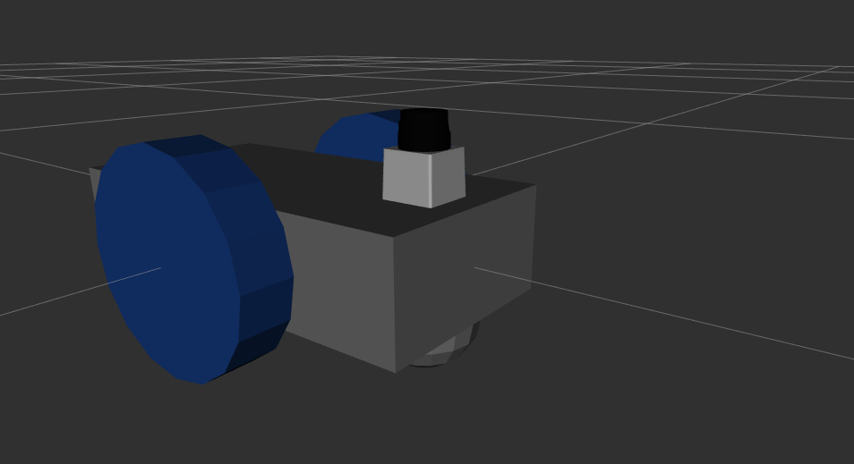

# diff_drive_robot_description

Descripción de un robot simple usando dirección diferencial *(differential drive)*.

Para visualizar el modelo del robot con rviz usar [launch/rviz.launch](launch/rviz.launch).
