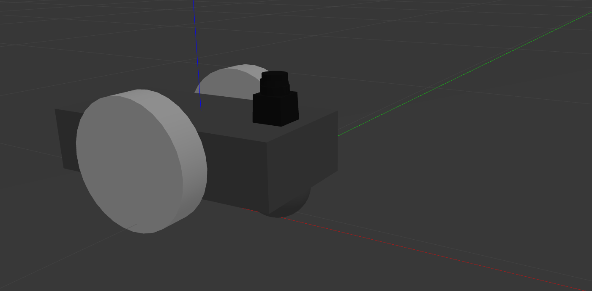

# diff_drive_robot_gazebo

Simulación de un robot con dirección diferencial *(differential drive)*.

Para ejecutar la simulación usar [launch/gazebo.launch](launch/gazebo.launch). Este lanzador carga el modelo a partir de lo definido en el archivo [urdf/gazebo.xacro](urdf/gazebo.xacro), que a su vez utiliza la descripción del robot del paquete **diff_drive_robot_description**



Para agregar el control del robot usar [launch/control.launch](launch/control.launch). Como control se utiliza el paquete [diff_drive_controller](http://wiki.ros.org/diff_drive_controller). 

El mismo se subscribe al topic */diff_drive_robot/cmd_vel* donde recibe mensajes del tipo [geometry_msgs/Twist Message](http://docs.ros.org/melodic/api/geometry_msgs/html/msg/Twist.html). De dichos mensajes solo se utilizan los componentes **linear.x** y **angular.z**, el resto se ignora.

Para comandar el robot mediante el teclado se puede hacer uso del paquete [teleop_twist_keyboard](http://wiki.ros.org/teleop_twist_keyboard) redirigiendo el topic en el cual publica de la siguiente manera:

```
$ rosrun teleop_twist_keyboard teleop_twist_keyboard.py cmd_vel:=diff_drive_robot/cmd_vel
```